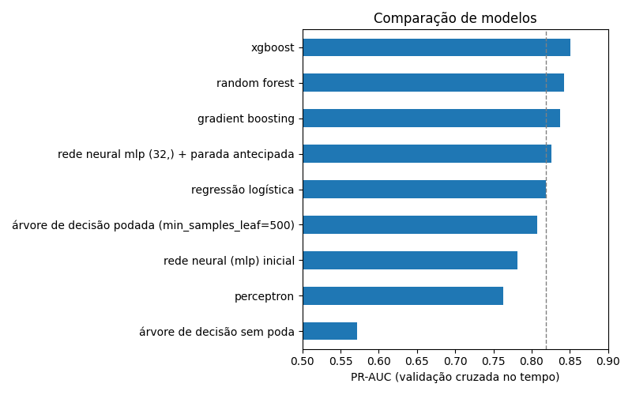
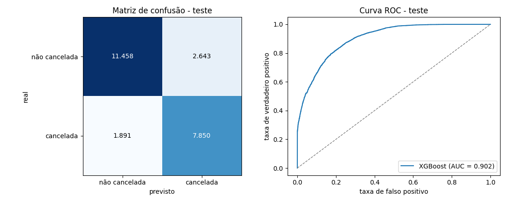
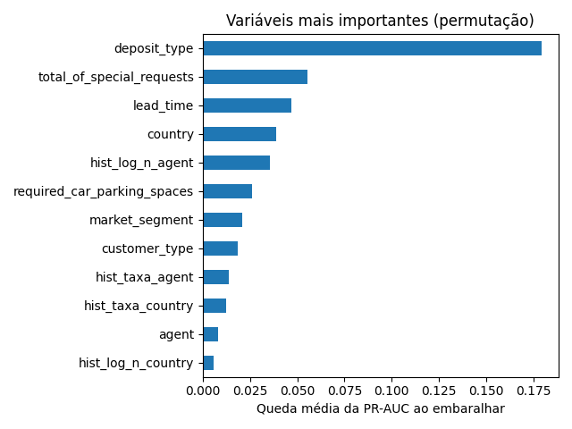

# Predição de Cancelamento de Reservas Hoteleiras

Projeto final da disciplina Aprendizagem de Máquina (Prof. Dr. Leandro Augusto
da Silva), Universidade Presbiteriana Mackenzie.

O objetivo é estimar a probabilidade de uma reserva de hotel ser cancelada,
usando só as informações disponíveis no momento da reserva. O modelo não
decide pelo hotel. Ele serve de apoio para a equipe de reservas: mostra quais
reservas merecem atenção, quantos cancelamentos esperar e onde está a receita
em risco.

## Dados

Uso o dataset Hotel Booking, do Kaggle
(https://www.kaggle.com/datasets/mojtaba142/hotel-booking). São 119.390
reservas de um City Hotel e de um Resort Hotel, com chegadas entre julho de
2015 e agosto de 2017. O alvo é `is_canceled` (1 = cancelada), e 37% das
reservas foram canceladas.

Uma cópia do arquivo está em `data/raw/hotel_booking.csv`. Os notebooks leem
o arquivo direto deste repositório:

```
https://raw.githubusercontent.com/josepharroyoh/hotel-cancellation-ml/main/data/raw/hotel_booking.csv
```

## Notebooks

O projeto segue as etapas do CRISP-DM. Os notebooks estão na pasta
`notebooks` e devem ser rodados em ordem:

| Notebook | O que tem |
|---|---|
| `01_data_understanding` | problema, objetivo e primeira análise da base |
| `02_eda` | análise exploratória |
| `03_data_preparation` | limpeza, variáveis novas e divisão em treino e teste |
| `04_experimental_design` | divisão dos dados, métricas, plano de testes e modelos de referência |
| `05_model_comparison` | comparação de algoritmos e corte no tempo x corte aleatório |
| `06_model_tuning_calibration` | revisão da preparação, variáveis de histórico, hiperparâmetros, peso da classe, calibração e limiar |
| `07_final_evaluation` | avaliação final no teste e confirmação do melhor modelo |
| `08_explainability_error_analysis` | o que o modelo aprendeu e onde erra |
| `09_business_use` | como o hotel pode usar o modelo |
| `10_conclusions` | modelo vencedor, modelo mais útil, limitações e próximos passos |

## Principais decisões

- Tirei as colunas que revelam o resultado (`reservation_status` e
  `reservation_status_date`), os identificadores artificiais (`name`,
  `email`, `phone-number` e `credit_card`) e as colunas que só existem depois
  da reserva (`assigned_room_type`, `booking_changes` e
  `days_in_waiting_list`).
- Dividi os dados pela data de chegada: os 80% mais antigos para treino e os
  20% mais recentes para teste. Dentro do treino uso validação cruzada no
  tempo (`TimeSeriesSplit`). O teste é usado uma única vez, no notebook 07.
- Mantive as linhas repetidas, porque a base não tem um identificador de
  reserva. O notebook 07 mostra que elas quase não mudam o resultado.
- Criei variáveis de histórico da agência e do país (número de reservas
  anteriores e taxa de cancelamento delas), calculadas só com reservas que já
  tinham chegado antes do dia da reserva. Foram a maior melhora do projeto.
- O pré-processamento fica dentro de um `Pipeline` do scikit-learn, ajustado
  só com o treino.
- A métrica principal é a PR-AUC. Também olho o Brier, porque a probabilidade
  do modelo é usada diretamente.

## Resultados

Comparei regressão logística, árvore de decisão, random forest, gradient
boosting, XGBoost, perceptron e redes neurais (MLP). A figura abaixo é a
comparação do notebook 05. Depois, no notebook 06, as variáveis de histórico
subiram a PR-AUC do XGBoost de 0,851 para 0,868 na validação cruzada. O
modelo final é o XGBoost com essas variáveis, que empatou com o gradient
boosting e ficou acima dos outros modelos.



No teste (reservas com chegada a partir de 22/04/2017, que o modelo não viu),
com limiar de 0,4:

| Métrica | Valor |
|---|---|
| PR-AUC | 0,868 |
| ROC-AUC | 0,902 |
| Recall | 0,806 |
| Precision | 0,748 |
| F1 | 0,776 |
| Brier | 0,126 |

O modelo avisa 81% dos cancelamentos, e 75% dos avisos estão certos. Sem as
variáveis de histórico, o mesmo XGBoost fica com PR-AUC de 0,849 no teste.



As variáveis que mais pesam são o tipo de depósito, as solicitações
especiais, a antecedência da reserva, o país e a agência (também pelo
histórico dela).



Para o hotel, o notebook 09 mostra que:

- com o mesmo número de alertas, o modelo pega 42% mais cancelamentos que
  uma regra simples tirada da análise exploratória;
- somando as probabilidades, a previsão de cancelamentos por semana erra em
  média 4,6%, contra 11,3% usando a taxa histórica;
- acompanhando só 10% das reservas sem depósito, escolhidas pelo valor em
  risco, a equipe cobre 45% da receita perdida com cancelamentos.

## Conclusões

As conclusões completas estão no notebook
[`10_conclusions`](notebooks/10_conclusions.ipynb): a resposta à pergunta do
projeto, os critérios de sucesso, o modelo vencedor e o mais útil, o que
cada teste mostrou, as limitações e os próximos passos.

## Estrutura do repositório

```
data/raw/               base original
notebooks/              notebooks 01 a 10
src/preprocessing.py    carga, limpeza, variáveis novas, histórico e divisão treino/teste
models/                 modelo final e configuração (gerados no notebook 07)
reports/figures/        figuras deste README
requirements.txt        bibliotecas usadas
```

## Como executar

Usei Python 3.10.

```bash
python -m venv .venv
.venv\Scripts\activate          # Windows
source .venv/bin/activate       # Linux ou Mac
pip install -r requirements.txt
jupyter notebook
```

Depois é só abrir a pasta `notebooks` e rodar os notebooks em ordem, do 01
ao 10. Os notebooks baixam a base deste repositório, então é preciso ter
internet. O notebook 07 salva o modelo em `models/`, e os notebooks 09 e 10
usam esse arquivo. Os notebooks 05 e 06 são os mais demorados (uns 15 e 20
minutos).
